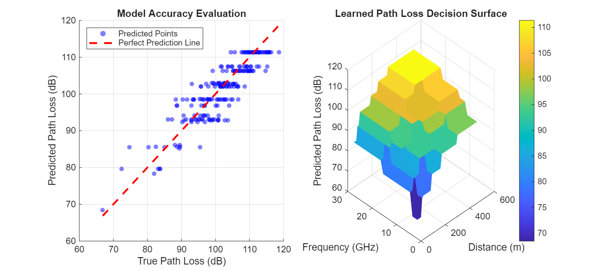

# ISAC Path Loss Predictor using Machine Learning

This repository contains a **MATLAB** implementation that replaces traditional empirical wireless communication formulas (like the Log-Distance model) with a data-driven Machine Learning approach. This forms Phase 1 of my roadmap toward building Agentic AI for Integrated Sensing and Communications (ISAC) systems.

## Problem Statement
Traditional path loss modeling relies on fixed parametric mathematical curves. In complex ISAC environments (e.g., joint radar tracking and communication), channels change dynamically. This project demonstrates how a lightweight Machine Learning model can learn a signal attenuation profile directly from data.

## Features Covered
- **Stochastic Data Generation:** Generates synthetic channel profiles including distance variations, frequency bands (Sub-6 to mmWave), and shadowing noise.
- **Data Partitioning:** Implements an 80/20 train/test evaluation split.
- **Machine Learning Architecture:** Trains a local Regression Tree model optimized for fast laptop execution.
- **Performance Evaluation:** Computes Root Mean Squared Error (RMSE) and Mean Absolute Error (MAE).

## Performance Visualization
The script automatically exports a performance evaluation plot showcasing the accuracy of the predictions against the actual data trends:

## How to Run
1. Open MATLAB on your machine.
2. Clone this repository or download `path_loss_predictor.m`.
3. Run the script. The trained model properties and metrics will display in the Command Window, and a performance graphic will save to your directory.

## Prerequisites
- MATLAB (R2021a or newer recommended)
- Statistics and Machine Learning Toolbox
