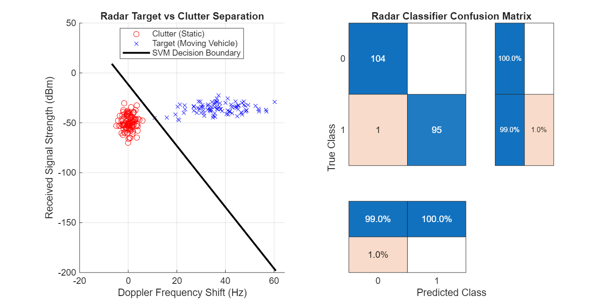

# Phase 1, Project 2: Radar Target Clutter Filter (SVM Classification)

This repository contains a **MATLAB** implementation of a data-driven radar sensing classifier. It replaces hardcoded threshold logic with a Support Vector Machine (SVM) to dynamically separate valid moving targets from environmental static background reflections.

## Problem Statement
In joint Integrated Sensing and Communications (ISAC) architectures, base stations must simultaneously transmit data and process radar echoes. A major issue is distinguishing moving vehicles (targets) from environmental clutter (e.g., swaying trees, buildings, signs). This project uses machine learning to automatically establish an optimal decision boundary between these two classes based on received signal characteristics.

## Applied Features & Features Derived
- **Radar Characteristic Modeling:** Generates multi-dimensional synthetic signatures tracking:
  - **Doppler Shift (Hz):** Captures target velocity profiles.
  - **Received Signal Strength (RSS, dBm):** Captures object material reflectivity characteristics.
- **Support Vector Machine (SVM):** Utilizes a linear kernel structure optimized for execution on standard laptop CPUs.
- **Sensing Metrics Framework:** Tracks performance via radar-critical parameters:
  - **False Alarms:** Static clutter mistakenly classified as a moving vehicle.
  - **Missed Detections:** Critical targets overlooked as background environmental clutter.

## Performance Visualization
Running the script outputs an interactive dashboard evaluating the spatial decision boundary alongside system classification accuracies:

## Code Breakdown & Deployment
1. Open MATLAB on your laptop.
2. Ensure you have the `Statistics and Machine Learning Toolbox` active.
3. Open and run `radar_clutter_filter.m`.
4. The system will evaluate the test partition data, display accuracy scores in the Command Window, and export the tracking graphic asset (`radar_clutter_results.png`) directly into your current directory.

## Prerequisites
- MATLAB (R2021a or newer recommended)
- Statistics and Machine Learning Toolbox
