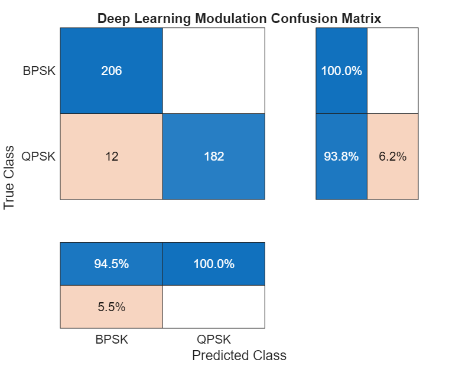

# Phase 2, Project 3: Micro-Modulation Classifier (Deep Learning)

This repository contains a **MATLAB** implementation of a dense Deep Neural Network (Multi-Layer Perceptron) designed to automatically categorize raw wireless signal formats.

## Problem Statement
In cognitive radio and dynamic ISAC environments, a base station or receiver must monitor the crowded RF spectrum and automatically deduce what modulation scheme a node is using before demodulating the incoming data stream. This project demonstrates how neural connections can recognize constellation geometry pattern shifts directly from raw, noisy, complex I/Q inputs.

## Architecture and Design
- **Synthetic Vector Generation:** Simulates true BPSK and QPSK constellations degraded by severe channel Additive White Gaussian Noise (AWGN).
- **Sequential Neural Layers:**
  - **Feature Input Block:** Receives 2D coordinate values corresponding to time-slice signal captures.
  - **Hidden Layers:** Implements a layered sequence of 16-node and 8-node dense connectivity matrices paired with Rectified Linear Unit (ReLU) functions.
  - **Decision Distribution:** Applies a Softmax normalization structure yielding final categorical probability scoring.

## Performance Optimization
The script triggers MATLAB's native training dashboard interface, plotting structural loss stabilization curves dynamically before exporting finalized tracking matrices:

## Prerequisites
- MATLAB (R2021a or newer)
- Deep Learning Toolbox
