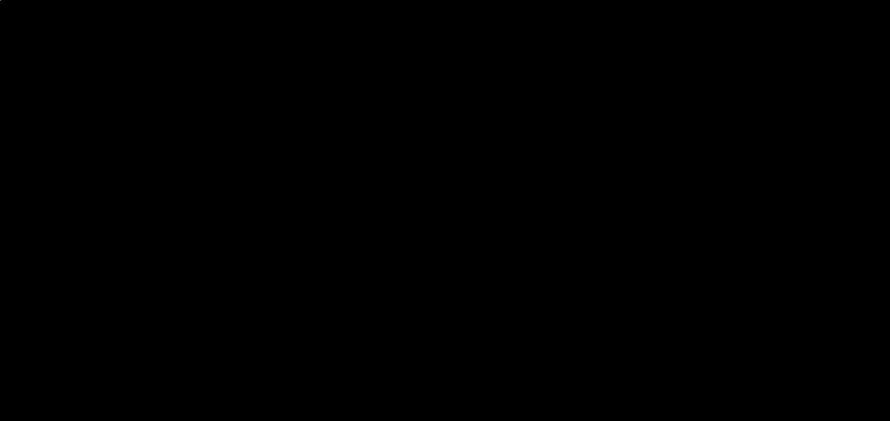

# Phase 3, Project 4: Synthetic Wireless Channel Generator (Generative AI)

This repository contains a **MATLAB** implementation of a Generative Autoencoder designed to model and synthesize multi-antenna MIMO wireless communication channels.

## Problem Statement
In modern ISAC and 5G/6G communication systems, evaluating physical algorithms requires extensive testing across diverse Channel State Information (CSI) matrices ($H$). Gathering real field measurements or running intensive ray-tracing software is computationally expensive. This project demonstrates how Generative AI can capture the underlying statistical scattering and fading properties of an environment to generate fresh, mathematically sound channel models on demand.

## Applied Architecture
- **MIMO Parameterization:** Models 2x2 complex matrix structures unfolded into an 8-dimensional real vector coordinate space.
- **Autoencoder Framework:** Passes data through a dimensional bottleneck (unsupervised compression layer).
- **Latent Space Sampling:** Extracts the statistical variance of the compressed bottleneck state, allowing random distribution sampling to act as a data generation trigger.
- **Linear Decoding Reconstruction:** Translates numerical code variables back into multi-antenna channel arrays matching the probability density profile of true Rayleigh fading channels.

## Verification Matrix
The generation accuracy is validated by comparing the true statistical probability density function (PDF) and structural spatial distribution layout against the AI-generated variants:

## Prerequisites
- MATLAB (R2021a or newer)
- Deep Learning Toolbox or Statistics and Machine Learning Toolbox
